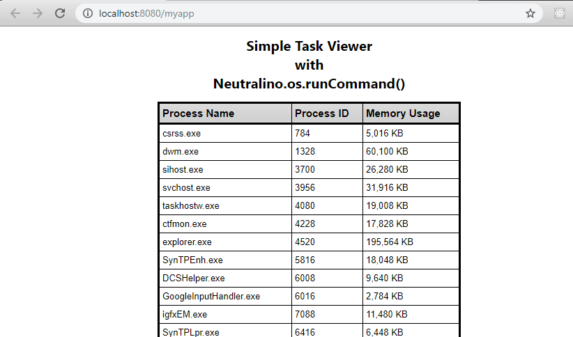

# Task Viewer App

A simple Neutralino App that displays a table containing active/running system processes  

## Running This application

1. Clone/Download this Repository
2. Open the `neutralino.exe` file.
3. The app fires up in your browser, it is running. 

The app closes as soon as you close the browser tab.

[View More Samples](https://github.com/neutralinojs/neutralinojs-samples)  

Build your own NeutralinoJs app? [Get Started](https://neutralinojs.github.io/docs/#/gettingstarted/quickstart)

